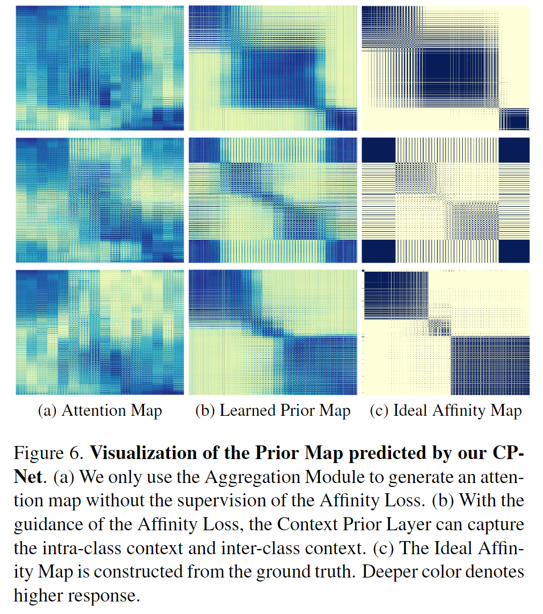

# Scene-Class Affinity Loss

Paper:[MonoScene: Monocular 3D Semantic Scene Completion](https://arxiv.org/abs/2112.00726)

Code: https://github.com/cv-rits/MonoScene

## Abstract

MonoScene proposes a 3D Semantic Scene Completion (SSC) framework, 
where the dense geometry and semantics of a scene are inferred from a single monocular RGB image. 
Different from the SSC literature, 
relying on 2.5 or 3D input, we solve the complex problem of 2D to 3D scene reconstruction while jointly inferring its semantics. 
Our framework relies on successive 2D and 3D UNets, 
bridged by a novel 2D3D features projection inspired by optics, 
and introduces a 3D context relation prior to enforce spatio-semantic consistency. 
Along with architectural contributions, we introduce novel global scene and local frustums losses. 
Experiments show we outperform the literature on all metrics and datasets while hallucinating plausible scenery even beyond the camera field of view

## Results in 3D SSC

coming soon

